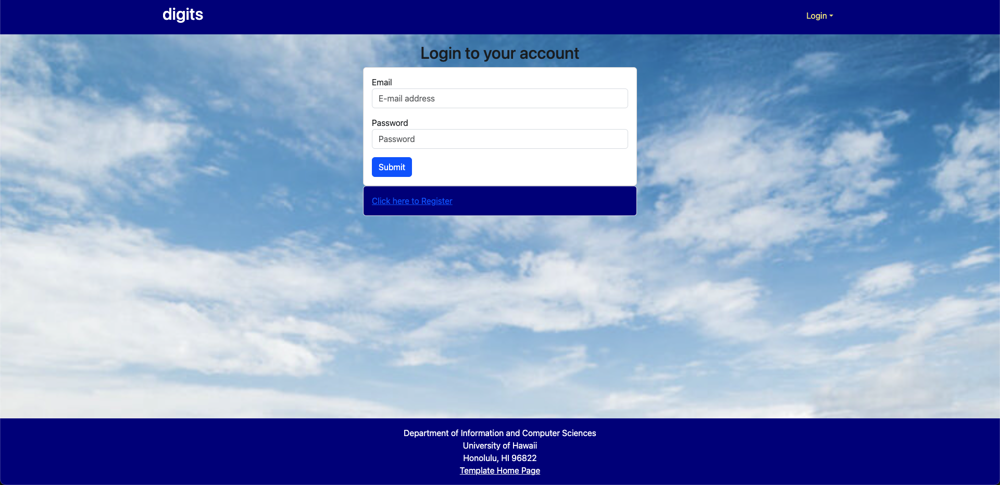
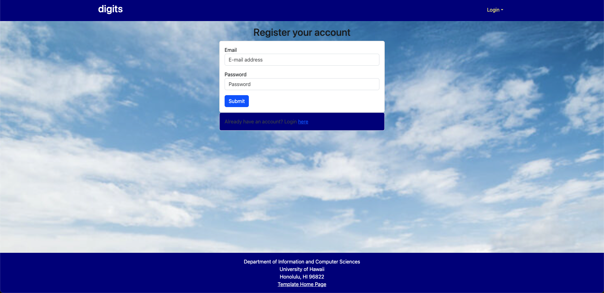
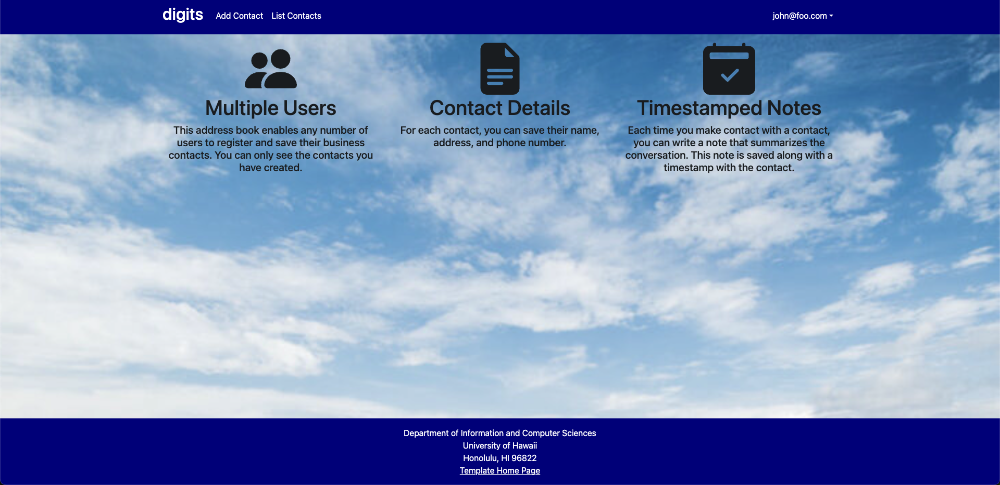
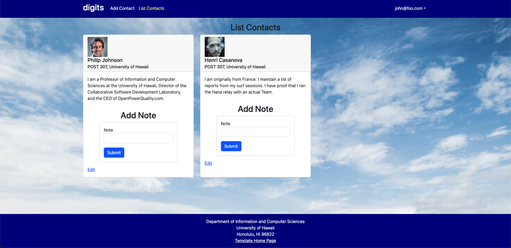
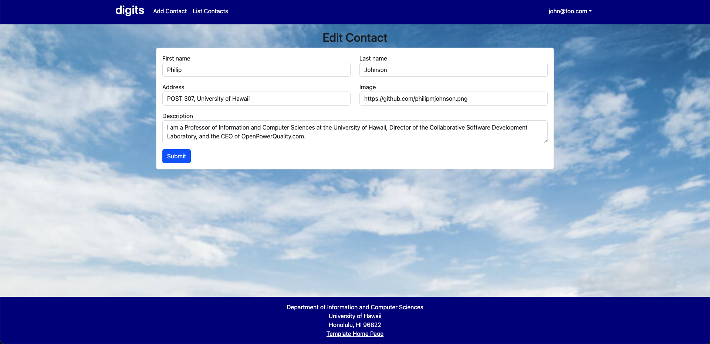
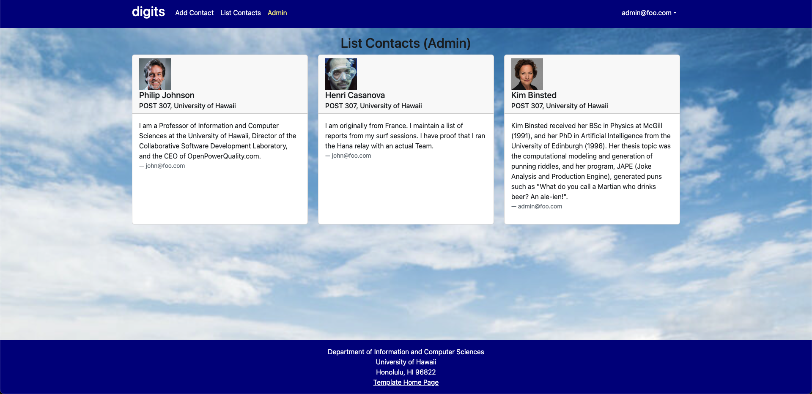
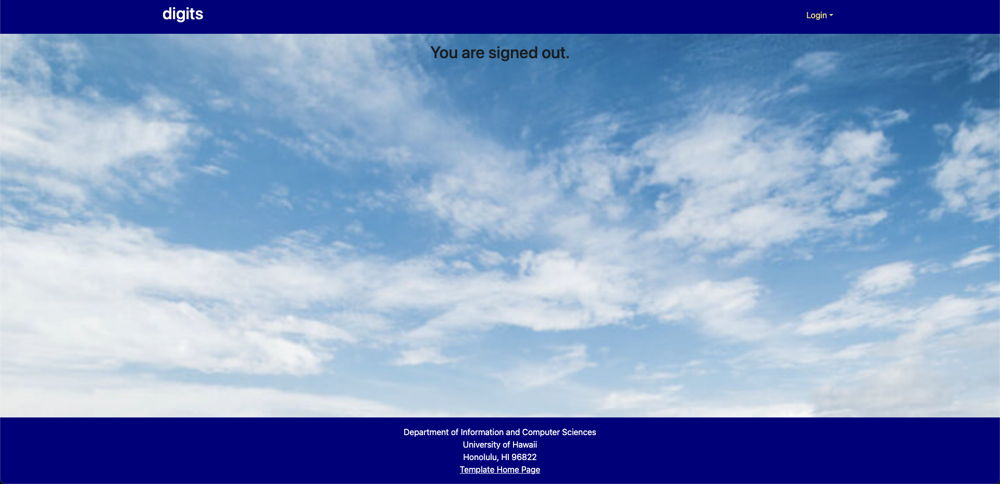

digits is a Meteor application based on the [meteor-application-template-react](https://ics-software-engineering.github.io/meteor-application-template-react/) template. 

The goal of digits is to act a an address book that allows users to create and manage contacts. Each contact has a first and last name, address, image, and description. Users can also add a note to each contact and it will add a timestamp to it. 

## Installation

First, [install Meteor](https://www.meteor.com/install).

Second, [downlad a copy of Digits](https://github.com/kayleeagorilla/digits). Since the repo for Digits is private, you will need to request permission to gain access in order to use or modify for your own use.

Third, cd into the app/ directory of your local copy of the repo, and install third party libraries using:

```
$ meteor npm install
```
## Running the system

After the libraries have been installed, run the application by invoking:

```
$ meteor npm run start
```

If this is the first time running the app, you will see that the app will create some default users and contacts. Here is the output:

```
 meteor npm run start

> meteor-application-template-react@ start /Users/kayleeag/Documents/ics314/GitHub/digits/app
> meteor --no-release-check --exclude-archs web.browser.legacy,web.cordova --settings ../config/settings.development.json

[[[[[ ~/Documents/ics314/GitHub/digits/app ]]]]]

=> Started proxy.                             
=> Started HMR server.                        
=> Started MongoDB.                           
I20231104-22:01:09.793(-10)? Creating the default user(s)
I20231104-22:01:09.806(-10)?   Creating user admin@foo.com.
I20231104-22:01:10.293(-10)?   Creating user john@foo.com.
I20231104-22:01:10.394(-10)? Creating default contacts.
I20231104-22:01:10.394(-10)?   Adding: Johnson (john@foo.com)
I20231104-22:01:10.423(-10)?   Adding: Casanova (john@foo.com)
I20231104-22:01:10.425(-10)?   Adding: Binsted (admin@foo.com)
=> Started your app.

=> App running at: http://localhost:3000/

```

### Viewing the running app

By clicking on the [http://localhost:3000](http://localhost:3000) link, you can view the application. You can login using the credentials in [settings.development.json](https://github.com/kayleeagorilla/digits/blob/main/config/settings.development.json), or create your own.

## Walkthrough

### Landing Page

The landing page is the first thing you see when you open the app. It contains an introduction on some of the features that the Digits website is capable of.


### Login

By clicking on the "Login" button located in the top right, you will be given the chose to "Sign in" using the given credentials previously mentioned or "Sign up" by registering your own account.
#### Sign In Page:


#### Sign Out Page:



### User Home Page

Once logged in, you will be redirected to the home page where you will see the "Add Contact" and "List Contacts" button in the NavBar.




### Add Contact

Clicking on the "Add Contact" button will bring you to the add contact page where you will be able to make a new contact. Here you can add the name, address, image, and description of a contact. 


### List Contacts

Clicking on the "List Contacts" button will bring you to the list contacts page where you will be able to view the contacts that you have created. Each contact will display their image, name, address, description, an "Add Note" section where you can add a note to the contact, and an "Edit" button.



### Edit Contact

By clicking the "Edit" button at the bottom, you will be sent to the edit contact page where you can edit any information and resubmit to save your changes.



### Admin Mode

If you logged in and had the "Admin" role assigned to your login credentials, you will gain access to the "Admin" button in the NavBar. Clicking on the "Admin" button will allow you to see all the contacts that have been created by all users. 



### Sign Out

Once you are done, you can simply click on the dropdown button in the top right and hit the "Sign Out" button. This will sign you out and redirect to the sign out page where it will confirm that you have been signed out by saying "You are signed out." 


